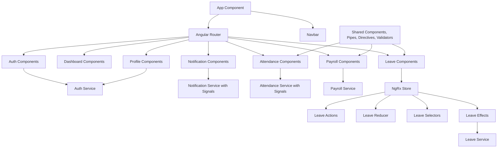
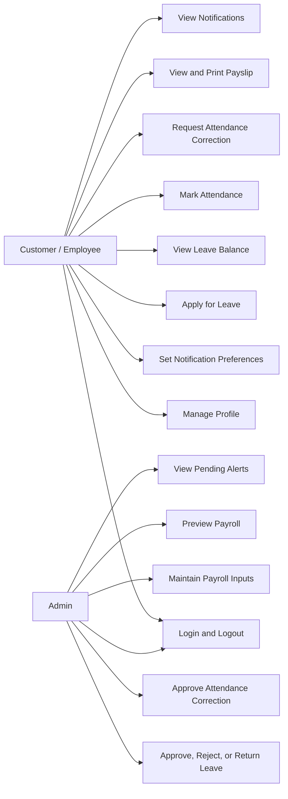

# Employee Leave, Attendance, and Payroll Self-Service Portal

Simple Angular 21 + TypeScript project for an employee self-service portal.

## Demo Login

- Employee: `employee@test.com` / `123456`
- Admin: `admin@test.com` / `123456`

## Main Features

- Login, logout, registration, role-based routing
- Employee profile and template-driven notification preferences
- Leave application, balance, calendar, and admin approval workflow
- NgRx is used only for the Leave Request and Approval Workflow
- Attendance marking, history, correction request, and admin regularization
- Payroll input dynamic form, payroll preview, payslip listing, and print view
- Notifications using Angular signals
- Custom validators for leave dates, leave balance, attendance remark, and payroll rules
- Custom pipes and directives
- HttpClient is configured with simple interceptors

## Run Project

```bash
npm install
npm start
```

Open `http://127.0.0.1:4200` or `http://localhost:4200`.

## Build

```bash
npm run build
```

## Component Diagram



## Use Case Diagram


